# Labeling Guide

This page documents the class taxonomy used to label regions of interest (ROIs) in ISIIS
imagery. Every thumbnail below is an actual crop from the `Baseline` labeled dataset
(`/mnt/CFElab/Data_analysis/ISIIS/AI/Baseline`), so use it as a visual reference when
deciding which class an ROI belongs to.

Descriptions are based on visual appearance in the shadowgraph imagery, not a formal
taxonomic identification — when a crop is ambiguous between two similar-looking classes,
check the "commonly confused with" notes and use your best judgement, or flag it for a
second opinion.

## Where labeling happens

ROIs are labeled/verified in [Tator](http://mantis.shore.mbari.org) (project `902111-CFE`).
Verified labels are exported to `isiis_labels.tsv` via
[`src/labeling/pulling_data.py`](https://github.com/flecaros-mbari/ISIIS_data_processing/blob/main/src/labeling/pulling_data.py),
and a curated snapshot (images, crops, and both YOLO `.txt` and Pascal VOC `.xml` annotation
formats) lives in the `Baseline` dataset referenced above.

## Class taxonomy

Counts are the number of labeled examples of each class in the current `Baseline` set —
useful context for how rare/common a class is, not a labeling instruction.

### Radiolarians & rhizarians

Single-celled protists with a dark central mass and radiating spines or a lattice-like
"shell". The `phaeodarian_A`–`F` classes are visually distinct morphotypes — compare
against all six before picking one.

| | Class | Count | Notes |
|---|---|---|---|
| 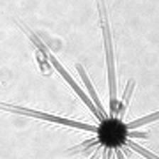 | `acantharia` | 9 | Small dark central capsule with a few long, straight, radiating spicules. |
| 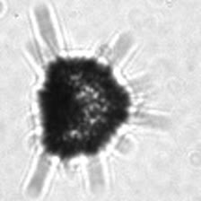 | `rhizaria` | 4 | Dense dark irregular clump with short spines radiating from the edge; more compact/less symmetric than acantharia. |
| 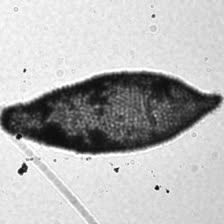 | `phaeodarian_A` | 36 | Solid dark oval body with a fine textured/granular interior, no long spines. |
| 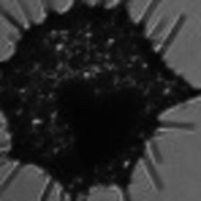 | `phaeodarian_B` | 20 | Dark irregular star-shaped mass with short jagged spines all around. |
| 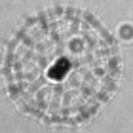 | `phaeodarian_C` | 8 | Round lattice/honeycomb "shell" pattern surrounding a small dark central body. |
| 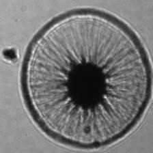 | `phaeodarian_D` | 4 | Round body with fine radial striations (sunburst pattern) around a solid dark center, no protruding spines. |
| 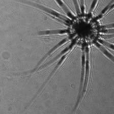 | `phaeodarian_E` | 4 | Dark center with a moderate number of long, thin, evenly spaced spines — sparser than acantharia. |
| 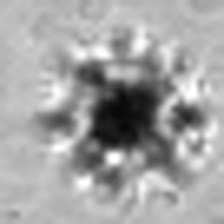 | `phaeodarian_F` | 5 | Small dark center with many short, fine spines giving a fuzzy/starburst edge. |

### Diatoms

| | Class | Count | Notes |
|---|---|---|---|
| 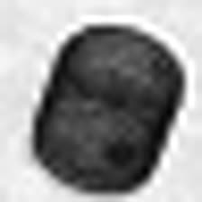 | `centric_diatom` | 27 | Single small, solid, roundish/barrel-shaped dark cell, no chain. |
| 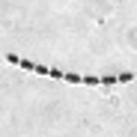 | `diatom_chain_straight` | 725 | Row of small dark cells strung together in a straight or gently curved line. |
| 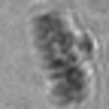 | `diatom_chain_spiral` | 2262 | Chain of cells curled into a tight spiral/coil rather than a line. |
| 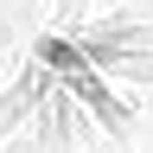 | `diatom_chain_spines` | 999 | Chain of cells with fine spines/setae radiating outward, giving a fan-like or bristly appearance. |

### Gelatinous zooplankton

`salp` and `siphonophore` look similar (both a ringed/barrel-shaped translucent body) —
check for a visible internal dark gut mass and trailing threads on both before deciding.

| | Class | Count | Notes |
|---|---|---|---|
| 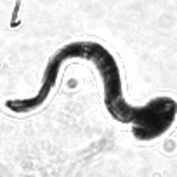 | `larvacean` | 355 | Dark, S-curved or comma-shaped elongated body, tadpole-like. |
| 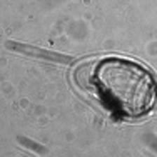 | `salp` | 5 | Translucent barrel/oval body with visible ring-like muscle bands and a small dark internal mass; often a thin trailing thread. |
| 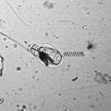 | `siphonophore` | 38 | Similar oval/barrel float with striations, usually paired with a long thin trailing tentacle/strand extending well outside the body. |
| 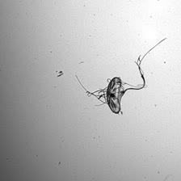 | `jelly` | 15 | Thin, irregular membranous outline with fine trailing tentacle-like strands; no compact solid body. |
| 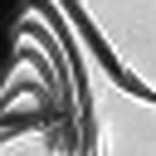 | `ctenophore` | 7 | Body showing parallel curved comb-row ridges/banding. |

### Crustaceans & other animals

| | Class | Count | Notes |
|---|---|---|---|
| 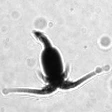 | `copepod` | 1358 | Small dark comma/teardrop-shaped body with thin trailing antennae/tail setae. |
| 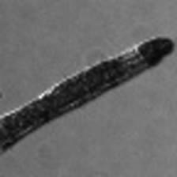 | `chaetognath` | 42 | Straight, elongated, torpedo-shaped translucent body tapering to a point (arrow worm). |
| 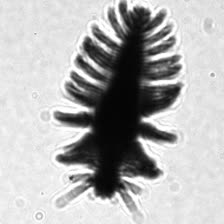 | `worm` | 12 | Elongated segmented body with paired bristle-like parapodia along both sides. |
| 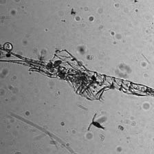 | `molt` | 5 | Empty, translucent, articulated exoskeleton outline (legs/antennae visible) with no solid dark body mass — a shed carapace, not a living animal. |
| 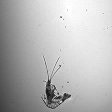 | `shrimp` | 7 | Visible jointed legs/antennae and a segmented body/tail fan. |
| 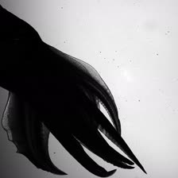 | `squid` | 1 | Large solid dark silhouette with a distinct mantle and fin shape. |

### Colonial algae

| | Class | Count | Notes |
|---|---|---|---|
| 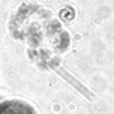 | `phaeocystis` | 2328 | Fuzzy, irregular dark colonial clump, usually trailing one or two long parallel straight strands. |

### Marine snow, aggregates & fecal material

The `aggregate*` classes are a density/compactness spectrum from loose flocculent material
(`aggregate_light`) to a solid dark mass (`aggregate_dense`) — when in doubt, compare the
crop against all four side by side.

| | Class | Count | Notes |
|---|---|---|---|
| 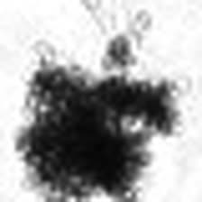 | `aggregate` | 452 | Fluffy, irregular dark clump with visible fine trailing strands/fibers. |
| 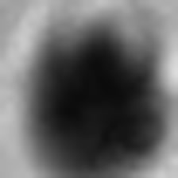 | `aggregate_dense` | 5815 | Solid, compact, uniformly dark blob with little internal structure — most common class in the set. |
| 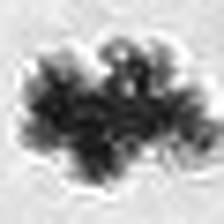 | `aggregate_light` | 287 | Looser, lower-contrast/more translucent version of `aggregate` — less dense, more diffuse edges. |
| 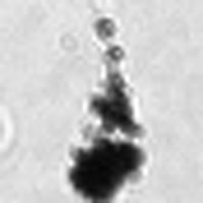 | `aggregate_string` | 740 | Aggregate mass hanging off a single long, thin string/strand. |
| 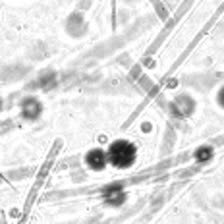 | `bloom` | 21311 | Frame scattered with many small round particles/cells rather than one discrete object — most common class overall. |
| 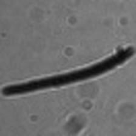 | `long_fecal_pellet` | 414 | Long, slender, solid dark cylindrical pellet, uniform width. |
| 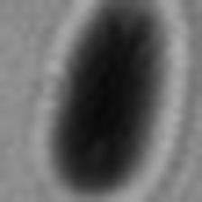 | `short_fecal_pellet` | 11 | Same as above but short/oval rather than elongated. |
| 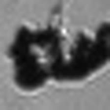 | `loose_fecal_pellet` | 221 | Irregular, crumbly-edged dark mass — less uniform/compact than a solid pellet. |

### Out-of-focus / blurred particles

| | Class | Count | Notes |
|---|---|---|---|
| 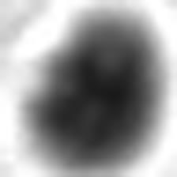 | `particle_blur` | 2107 | Rounded, soft-edged, out-of-focus dark blob — no sharp edges anywhere in the crop. Compare against `aggregate_dense`, which is similar but in-focus with a defined edge. |
| 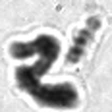 | `long_particle_blur` | 313 | Same as above but elongated/curved rather than round. |

### Non-biological / imaging artifacts

Not organisms — these are optical artifacts, noise, or imaging debris. They still need to
be labeled so they can be filtered out of ecological analyses downstream.

| | Class | Count | Notes |
|---|---|---|---|
| 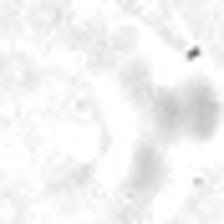 | `artifact` | 9526 | Faint, indistinct, low-contrast smudge with no clear boundary — not a real particle. |
| 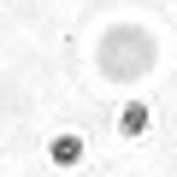 | `noise` | 2383 | Small faint speck(s)/soft circular blobs, sensor or optical noise rather than a discrete object. |
| 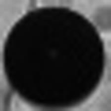 | `bubble` | 1501 | Perfectly circular, uniformly solid black disc with a sharp, clean edge. |
| 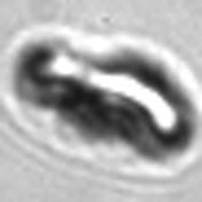 | `football` | 120 | Oval, out-of-focus artifact resembling an American football, with bright/dark banding. |
| 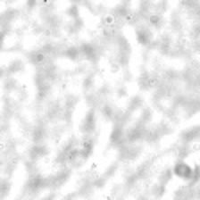 | `density` | 1052 | Diffuse, large-scale mottled shading across the whole frame (a water density/optical gradient), no discrete object. |
| 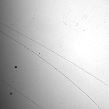 | `string` | 330 | Thin straight or gently curved line(s) crossing the frame — a fiber or optical streak, not attached to any organism/aggregate. |

## Annotation formats

The `Baseline` dataset stores the same labels in three parallel formats:

- **`localizations.csv`** — one row per ROI: `media`, `frame`, `uuid`, `label`,
  `predicted_label`, `score`, and normalized `x`/`y`/`width`/`height`. This is the format
  produced by [`src/labeling/pulling_data.py`](https://github.com/flecaros-mbari/ISIIS_data_processing/blob/main/src/labeling/pulling_data.py).
- **`labels/*.txt`** — YOLO format: `class_id x_center y_center width height`, normalized
  0–1, one file per image, class IDs matching the line order in `labels.txt`.
- **`voc/*.xml`** — Pascal VOC format: one XML file per image with pixel-coordinate
  `<bndbox>` elements and a `<name>` per object.

`crops/<class>/*.jpg` (used for the thumbnails on this page) are pre-cropped 224×224 ROI
images, one subfolder per class, generated from the same localizations by
[`src/data-handling/create_folder.py`](https://github.com/flecaros-mbari/ISIIS_data_processing/blob/main/src/data-handling/create_folder.py).
